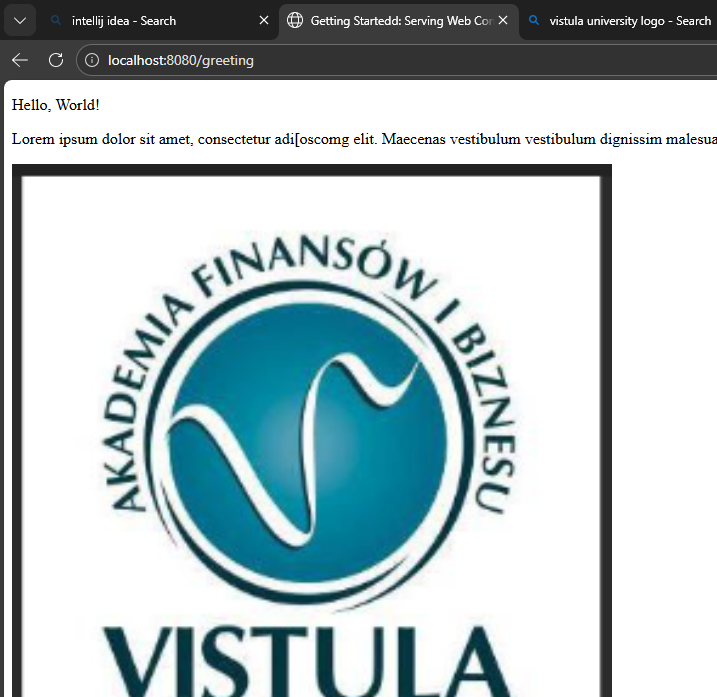
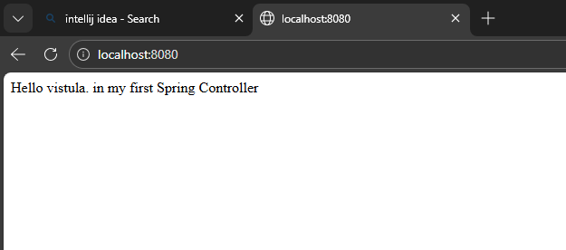
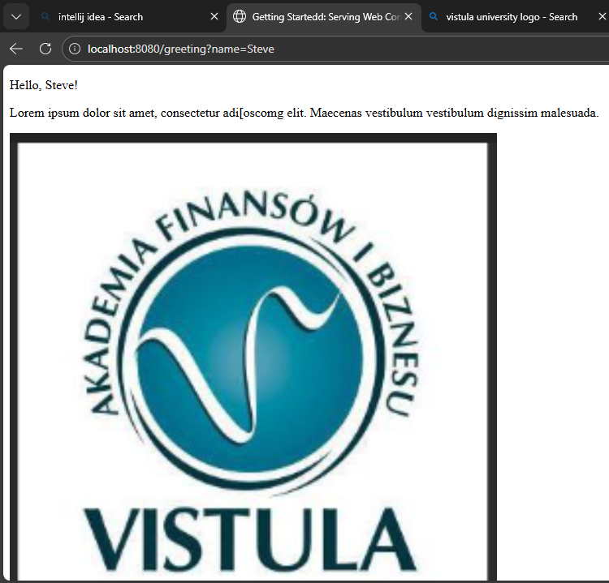

# Spring Boot Application – Controller, HTTP Requests & @ResponseBody

This repository contains a simple Spring Boot application created from scratch.  
The application demonstrates how to define a Spring controller, launch the application, and handle HTTP requests using different HTTP methods.  
It also explains the role and behavior of the `@ResponseBody` annotation.

---

## 📌 Project Description

The application starts an embedded web server and exposes HTTP endpoints that return data directly in the HTTP response body.  
The goal is to illustrate the basic request–response cycle in a Spring Boot web application.

---

## 🛠️ Technologies Used

- Java
- Spring Boot
- Maven

## How to Run
1.  Open the project in IntelliJ.
2.  Run the command: `./mvnw spring-boot:run`
3.  Open your browser to the links below.

## App Links (Endpoints)

Here are the three pages I created for this task:

### 1. Home Page
Shows the welcome text and the Vistula logo.
* **Link:** http://localhost:8080/
* Result: 

### 2. Standard Greeting
Shows a default greeting message.
* **Link:** http://localhost:8080/greeting
* Result:

### 3. Custom Greeting
Shows a greeting using the name "Steve".
* **Link:** http://localhost:8080/greeting?name=Student
* Result: 